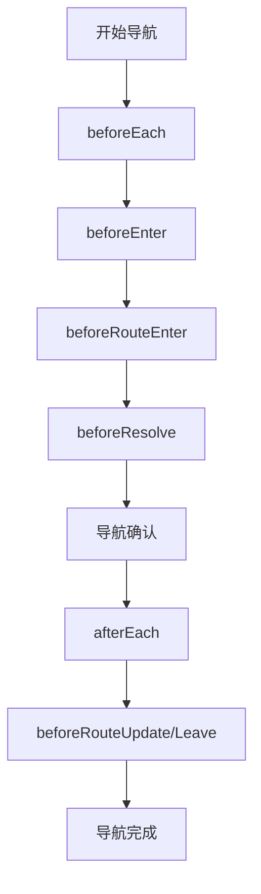

# 导航守卫

导航守卫是路由跳转过程中的钩子函数，用于控制导航流程。`@ldesign/router` 提供了完整的导航守卫系统，支持全局守卫、路由级守卫和组件内守卫。

## 守卫类型

### 全局守卫

- **beforeEach** - 全局前置守卫
- **beforeResolve** - 全局解析守卫
- **afterEach** - 全局后置守卫

### 路由级守卫

- **beforeEnter** - 路由独享守卫

### 组件内守卫

- **beforeRouteEnter** - 进入组件前
- **beforeRouteUpdate** - 路由更新时
- **beforeRouteLeave** - 离开组件前

## 守卫执行顺序



## 全局前置守卫

### 基础用法

```typescript
import { createLDesignRouter } from '@ldesign/router'

const router = createLDesignRouter({ routes })

router.beforeEach((to, from, next) => {
  console.log('导航到:', to.path)
  next()
})
```

### 认证守卫

```typescript
// 认证检查
router.beforeEach((to, from, next) => {
  if (to.meta?.requiresAuth) {
    const token = localStorage.getItem('token')
    if (!token) {
      next('/login')
      return
    }

    // 验证 token 有效性
    if (!isValidToken(token)) {
      localStorage.removeItem('token')
      next('/login')
      return
    }
  }

  next()
})
```

### 权限守卫

```typescript
// 权限检查
router.beforeEach((to, from, next) => {
  // 跳过不需要权限的页面
  if (!to.meta?.roles && !to.meta?.permissions) {
    next()
    return
  }

  const user = getCurrentUser()
  if (!user) {
    next('/login')
    return
  }

  // 检查角色权限
  if (to.meta.roles) {
    const hasRole = to.meta.roles.some(role => user.roles.includes(role))
    if (!hasRole) {
      next('/403')
      return
    }
  }

  // 检查具体权限
  if (to.meta.permissions) {
    const hasPermission = to.meta.permissions.every(permission =>
      user.permissions.includes(permission)
    )
    if (!hasPermission) {
      next('/403')
      return
    }
  }

  next()
})
```

### 加载状态守卫

```typescript
// 显示加载状态
router.beforeEach((to, from, next) => {
  // 显示全局加载指示器
  showGlobalLoading()
  next()
})

router.afterEach(() => {
  // 隐藏全局加载指示器
  hideGlobalLoading()
})
```

## 全局解析守卫

在导航被确认之前，同时在所有组件内守卫和异步路由组件被解析之后调用：

```typescript
router.beforeResolve((to, from, next) => {
  // 确保所有异步组件都已解析
  if (to.matched.some(record => record.components)) {
    console.log('所有组件已解析')
  }
  next()
})
```

## 全局后置守卫

```typescript
router.afterEach((to, from, failure) => {
  // 更新页面标题
  document.title = to.meta?.title || 'My App'

  // 发送页面访问统计
  analytics.track('page_view', {
    path: to.path,
    name: to.name,
    from: from.path
  })

  // 处理导航失败
  if (failure) {
    console.error('导航失败:', failure)
  }
})
```

## 路由独享守卫

在路由配置中直接定义：

```typescript
const routes = [
  {
    path: '/admin',
    component: AdminView,
    beforeEnter: (to, from, next) => {
      // 只有管理员可以访问
      if (!isAdmin()) {
        next('/403')
      }
 else {
        next()
      }
    }
  },
  {
    path: '/user/:id',
    component: UserDetail,
    beforeEnter: [
      // 支持多个守卫
      checkUserExists,
      checkUserPermission
    ]
  }
]

// 守卫函数
function checkUserExists(to, from, next) {
  const userId = to.params.id
  if (userExists(userId)) {
    next()
  }
 else {
    next('/404')
  }
}

function checkUserPermission(to, from, next) {
  const userId = to.params.id
  if (canViewUser(userId)) {
    next()
  }
 else {
    next('/403')
  }
}
```

## 组件内守卫

### beforeRouteEnter

```vue
<script setup lang="ts">
import { onBeforeRouteEnter } from '@ldesign/router'

// 进入组件前调用
onBeforeRouteEnter((to, from, next) => {
  // 在组件实例创建前调用
  // 不能访问 this

  // 预加载数据
  loadUserData(to.params.id).then((user) => {
    next((vm) => {
      // 通过回调访问组件实例
      vm.user = user
    })
  }).catch(() => {
    next('/error')
  })
})
</script>
```

### beforeRouteUpdate

```vue
<script setup lang="ts">
import { onBeforeRouteUpdate } from '@ldesign/router'

// 路由更新时调用（如参数变化）
onBeforeRouteUpdate((to, from, next) => {
  // 参数变化时重新加载数据
  if (to.params.id !== from.params.id) {
    loadUserData(to.params.id).then(() => {
      next()
    }).catch(() => {
      next('/error')
    })
  }
 else {
    next()
  }
})
</script>
```

### beforeRouteLeave

```vue
<script setup lang="ts">
import { onBeforeRouteLeave } from '@ldesign/router'

const hasUnsavedChanges = ref(false)

// 离开组件前调用
onBeforeRouteLeave((to, from, next) => {
  if (hasUnsavedChanges.value) {
    const answer = window.confirm('您有未保存的更改，确定要离开吗？')
    if (answer) {
      next()
    }
 else {
      next(false) // 取消导航
    }
  }
 else {
    next()
  }
})
</script>
```

## 高级用法

### 异步守卫

```typescript
// 异步权限检查
router.beforeEach(async (to, from, next) => {
  if (to.meta?.requiresAuth) {
    try {
      // 异步验证用户权限
      const user = await validateUser()
      if (user) {
        next()
      }
 else {
        next('/login')
      }
    }
 catch (error) {
      console.error('权限验证失败:', error)
      next('/error')
    }
  }
 else {
    next()
  }
})
```

### 条件守卫

```typescript
// 基于条件的守卫
function createConditionalGuard(condition: () => boolean, redirectTo: string) {
  return (to: any, from: any, next: any) => {
    if (condition()) {
      next()
    }
 else {
      next(redirectTo)
    }
  }
}

// 使用条件守卫
const adminGuard = createConditionalGuard(
  () => getCurrentUser()?.role === 'admin',
  '/403'
)

router.beforeEach(adminGuard)
```

### 守卫组合

```typescript
// 组合多个守卫
function combineGuards(...guards: NavigationGuard[]) {
  return async (to: any, from: any, next: any) => {
    for (const guard of guards) {
      const result = await new Promise<any>((resolve) => {
        guard(to, from, result => resolve(result))
      })

      if (result !== undefined) {
        next(result)
        return
      }
    }
    next()
  }
}

// 使用组合守卫
const combinedGuard = combineGuards(
  authGuard,
  permissionGuard,
  rateLimitGuard
)

router.beforeEach(combinedGuard)
```

### 守卫中间件

```typescript
// 守卫中间件系统
class GuardMiddleware {
  private middlewares: NavigationGuard[] = []

  use(middleware: NavigationGuard) {
    this.middlewares.push(middleware)
  }

  async execute(to: any, from: any, next: any) {
    const index = 0

    const dispatch = (i: number): any => {
      if (i >= this.middlewares.length) {
        return next()
      }

      const middleware = this.middlewares[i]
      return middleware(to, from, (result) => {
        if (result !== undefined) {
          return next(result)
        }
        return dispatch(i + 1)
      })
    }

    return dispatch(0)
  }
}

// 使用中间件
const guardMiddleware = new GuardMiddleware()

guardMiddleware.use(authMiddleware)
guardMiddleware.use(permissionMiddleware)
guardMiddleware.use(loggingMiddleware)

router.beforeEach((to, from, next) => {
  guardMiddleware.execute(to, from, next)
})
```

## 错误处理

### 守卫错误处理

```typescript
router.beforeEach((to, from, next) => {
  try {
    // 守卫逻辑
    if (checkPermission(to)) {
      next()
    }
 else {
      next('/403')
    }
  }
 catch (error) {
    console.error('守卫执行错误:', error)

    // 发送错误报告
    errorReporting.captureException(error)

    // 降级处理
    next('/error')
  }
})
```

### 导航失败处理

```typescript
router.onError((error) => {
  console.error('导航错误:', error)

  // 根据错误类型处理
  if (error.name === 'NavigationDuplicated') {
    // 重复导航，忽略
    return
  }

  if (error.name === 'NavigationAborted') {
    // 导航被中止
    showMessage('导航被取消')
    return
  }

  // 其他错误
  showErrorMessage('页面加载失败')
})
```

## 性能优化

### 守卫缓存

```typescript
// 缓存权限检查结果
const permissionCache = new Map()

router.beforeEach((to, from, next) => {
  const cacheKey = `${to.path}-${getCurrentUser()?.id}`

  if (permissionCache.has(cacheKey)) {
    const hasPermission = permissionCache.get(cacheKey)
    if (hasPermission) {
      next()
    }
 else {
      next('/403')
    }
    return
  }

  // 执行权限检查
  const hasPermission = checkPermission(to)
  permissionCache.set(cacheKey, hasPermission)

  if (hasPermission) {
    next()
  }
 else {
    next('/403')
  }
})

// 用户变更时清除缓存
onUserChange(() => {
  permissionCache.clear()
})
```

### 守卫去重

```typescript
// 避免重复执行相同的守卫
let lastGuardExecution = ''

router.beforeEach((to, from, next) => {
  const currentExecution = `${to.path}-${from.path}`

  if (currentExecution === lastGuardExecution) {
    next()
    return
  }

  lastGuardExecution = currentExecution

  // 执行守卫逻辑
  performGuardCheck(to, from, next)
})
```

导航守卫是构建安全、可靠路由系统的重要工具。通过合理使用各种类型的守卫，可以实现复杂的导航控制逻辑。
