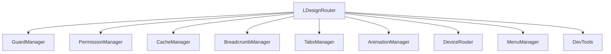

# 核心概念

本章节将详细介绍 `@ldesign/router` 的核心概念，帮助您深入理解路由管理的工作原理。

## 路由器架构

`@ldesign/router` 采用模块化架构设计，将不同功能分离到独立的管理器中：



### 核心组件

- **LDesignRouter** - 主路由器类，协调各个管理器
- **GuardManager** - 导航守卫管理
- **PermissionManager** - 权限控制管理
- **CacheManager** - 页面缓存管理
- **BreadcrumbManager** - 面包屑导航管理
- **TabsManager** - 标签页管理
- **AnimationManager** - 路由动画管理
- **DeviceRouter** - 设备适配管理
- **MenuManager** - 菜单管理
- **DevTools** - 开发工具

## 路由配置

### 基础路由配置

```typescript
interface RouteConfig {
  path: string // 路由路径
  name?: string // 路由名称
  component?: Component // 路由组件
  components?: Record<DeviceType, Component> // 设备特定组件
  children?: RouteConfig[] // 子路由
  meta?: RouteMeta // 路由元信息
  redirect?: string | RouteLocation // 重定向
  alias?: string | string[] // 路由别名
  beforeEnter?: NavigationGuard // 路由级守卫
  props?: boolean | Record<string, any> // 组件属性
}
```

### 路由元信息

路由元信息用于存储路由的附加信息：

```typescript
interface RouteMeta {
  title?: string // 页面标题
  icon?: string // 图标
  requiresAuth?: boolean // 是否需要认证
  roles?: string[] // 所需角色
  permissions?: string[] // 所需权限
  cache?: boolean // 是否缓存
  animation?: string // 动画类型
  breadcrumb?: boolean // 是否显示面包屑
  tab?: boolean // 是否显示标签页
  menu?: boolean // 是否显示在菜单中
  layout?: string // 布局类型
  keepAlive?: boolean // 是否保持活跃
}
```

### 示例配置

```typescript
const routes: RouteConfig[] = [
  {
    path: '/',
    name: 'Home',
    component: () => import('@/views/Home.vue'),
    meta: {
      title: '首页',
      icon: 'home',
      breadcrumb: true,
      tab: false
    }
  },
  {
    path: '/admin',
    name: 'Admin',
    component: () => import('@/layouts/AdminLayout.vue'),
    meta: {
      title: '管理后台',
      requiresAuth: true,
      roles: ['admin']
    },
    children: [
      {
        path: 'users',
        name: 'AdminUsers',
        component: () => import('@/views/admin/Users.vue'),
        meta: {
          title: '用户管理',
          permissions: ['user:view'],
          cache: true
        }
      }
    ]
  }
]
```

## 导航守卫

导航守卫是路由跳转过程中的钩子函数，用于控制导航流程。

### 守卫类型

1. **全局前置守卫** - 在路由跳转前执行
2. **全局解析守卫** - 在路由解析完成后执行
3. **全局后置守卫** - 在路由跳转完成后执行
4. **路由级守卫** - 在特定路由上执行

### 守卫执行顺序

```
1. 全局前置守卫 (beforeEach)
2. 路由级前置守卫 (beforeEnter)
3. 组件内守卫 (beforeRouteEnter)
4. 全局解析守卫 (beforeResolve)
5. 导航确认
6. 全局后置守卫 (afterEach)
7. 组件内守卫 (beforeRouteUpdate/beforeRouteLeave)
```

### 守卫示例

```typescript
// 全局前置守卫
router.beforeEach((to, from, next) => {
  // 检查认证状态
  if (to.meta?.requiresAuth && !isAuthenticated()) {
    next('/login')
  }
 else {
    next()
  }
})

// 全局后置守卫
router.afterEach((to, from) => {
  // 更新页面标题
  document.title = to.meta?.title || 'My App'
})
```

## 权限管理

权限管理是企业级应用的重要功能，支持基于角色和权限的访问控制。

### 权限模式

- **role** - 仅基于角色检查
- **permission** - 仅基于权限检查
- **both** - 同时检查角色和权限

### 权限配置

```typescript
const router = createLDesignRouter({
  routes,
  permission: {
    enabled: true,
    mode: 'both',
    checkRole: (roles: string[]) => {
      const userRoles = getCurrentUser().roles
      return roles.some(role => userRoles.includes(role))
    },
    checkPermission: (permissions: string[]) => {
      const userPermissions = getCurrentUser().permissions
      return permissions.every(permission =>
        userPermissions.includes(permission)
      )
    },
    redirectPath: '/login'
  }
})
```

### 动态权限

```typescript
// 设置当前用户
router.permissionManager.setCurrentUser({
  id: '1',
  name: 'John Doe',
  roles: ['admin', 'user'],
  permissions: ['user:view', 'user:edit', 'admin:access']
})

// 检查权限
const hasPermission = router.permissionManager.checkRoutePermission(route)
```

## 缓存管理

缓存管理用于优化页面性能，减少重复渲染。

### 缓存策略

- **LRU** (Least Recently Used) - 最近最少使用
- **FIFO** (First In First Out) - 先进先出
- **Custom** - 自定义策略

### 缓存配置

```typescript
const router = createLDesignRouter({
  routes,
  cache: {
    enabled: true,
    strategy: 'lru',
    max: 10, // 最大缓存数量
    ttl: 300000, // 缓存时间 (5分钟)
    storage: 'memory' // 存储方式
  }
})
```

### 缓存控制

```typescript
// 路由级缓存控制
{
  path: '/list',
  name: 'List',
  component: ListView,
  meta: {
    cache: true,        // 启用缓存
    cacheTTL: 600000   // 自定义缓存时间
  }
}

// 程序化缓存控制
router.cacheManager.clearCache()           // 清空所有缓存
router.cacheManager.removeFromCache(key)   // 移除特定缓存
```

## 设备适配

设备适配功能根据用户设备类型提供不同的路由组件。

### 设备类型

- **desktop** - 桌面设备
- **tablet** - 平板设备
- **mobile** - 移动设备

### 设备配置

```typescript
const router = createLDesignRouter({
  routes: [
    {
      path: '/product/:id',
      name: 'Product',
      components: {
        desktop: () => import('@/views/ProductDesktop.vue'),
        tablet: () => import('@/views/ProductTablet.vue'),
        mobile: () => import('@/views/ProductMobile.vue')
      }
    }
  ],
  deviceRouter: {
    enabled: true,
    breakpoints: {
      mobile: 768,
      tablet: 1024
    },
    defaultDevice: 'desktop'
  }
})
```

### 设备检测

```typescript
import { useDeviceRouter } from '@ldesign/router'

const { deviceInfo, isMobile, isTablet, isDesktop } = useDeviceRouter()

// 设备信息
console.log(deviceInfo.value.type) // 'mobile' | 'tablet' | 'desktop'
console.log(deviceInfo.value.width) // 屏幕宽度
console.log(deviceInfo.value.height) // 屏幕高度
```

## 面包屑导航

面包屑导航自动根据路由层级生成导航路径。

### 面包屑配置

```typescript
const router = createLDesignRouter({
  routes,
  breadcrumb: {
    enabled: true,
    separator: '/',
    showHome: true,
    homeText: '首页',
    homePath: '/',
    maxItems: 10
  }
})
```

### 使用面包屑

```vue
<script setup lang="ts">
import { useBreadcrumb } from '@ldesign/router'

const { breadcrumbs, separator } = useBreadcrumb()
</script>

<template>
  <nav class="breadcrumb">
    <span v-for="(item, index) in breadcrumbs" :key="index">
      <router-link v-if="item.path && !item.disabled" :to="item.path">
        {{ item.title }}
      </router-link>
      <span v-else>{{ item.title }}</span>
      <span v-if="index < breadcrumbs.length - 1" class="separator">
        {{ separator }}
      </span>
    </span>
  </nav>
</template>
```

## 标签页管理

标签页管理支持多标签页导航，提供丰富的交互功能。

### 标签页配置

```typescript
const router = createLDesignRouter({
  routes,
  tabs: {
    enabled: true,
    max: 10,
    persistent: true,
    closable: true,
    draggable: true,
    contextMenu: true,
    cache: true
  }
})
```

### 标签页操作

```typescript
import { useTabs } from '@ldesign/router'

const { tabs, activeTabId, addTab, closeTab, closeOtherTabs } = useTabs()

// 关闭标签页
closeTab('tab-id')

// 关闭其他标签页
closeOtherTabs('keep-tab-id')
```

## 路由动画

路由动画为页面切换提供流畅的视觉效果。

### 动画类型

- **fade** - 淡入淡出
- **slide** - 滑动
- **zoom** - 缩放
- **custom** - 自定义

### 动画配置

```typescript
const router = createLDesignRouter({
  routes,
  animation: {
    enabled: true,
    type: 'slide',
    duration: 300,
    easing: 'ease-in-out',
    direction: 'right'
  }
})
```

### 自定义动画

```css
/* 自定义动画样式 */
.my-custom-enter-active,
.my-custom-leave-active {
  transition: all 0.3s ease;
}

.my-custom-enter-from {
  opacity: 0;
  transform: translateY(20px);
}

.my-custom-leave-to {
  opacity: 0;
  transform: translateY(-20px);
}
```

## 开发工具

开发工具提供强大的调试和监控功能。

### 开发工具功能

- **路由检查器** - 查看当前路由信息
- **性能监控** - 监控路由切换性能
- **错误跟踪** - 跟踪路由相关错误
- **缓存查看器** - 查看缓存状态
- **动画调试器** - 调试路由动画

### 启用开发工具

```typescript
const router = createLDesignRouter({
  routes,
  devTools: process.env.NODE_ENV === 'development'
})
```

## 总结

`@ldesign/router` 通过模块化的架构设计，将复杂的路由功能分解为独立的管理器，每个管理器专注于特定的功能领域。这种设计不仅提高了代码的可维护性，也使得功能扩展更加容易。

理解这些核心概念将帮助您更好地使用 `@ldesign/router` 构建复杂的企业级应用。
